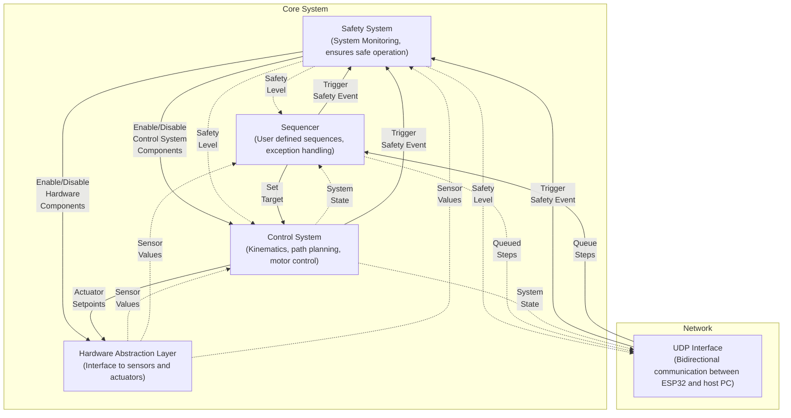

# Mobiler Ausbildungsroboter ESP32

[](https://github.com/robotics-ost/met3_r_template/actions/workflows/pages/pages-build-deployment)&emsp;
[](https://github.com/robotics-ost/met3_r_template/actions/workflows/create_release_on_tag.yml)&emsp;
[](https://robotics-ost.github.io/met3_r_template/)

This repo serves as a template for the MeT3_R practica. It contains the starter code to programm a mobile differential-drive robot educational platform built on the **Waveshare General Driver for Robots (ESP32-WROOM-32UE)** with **ESP-IDF** and **PlatformIO**.

## Architecture Overview

The core system is designed in four layers (Safety System, Control System, Sequencer, Hardware Abstraction Layer). In addition, the network interface enables the user to interact with the robot via telemetry. Solid lines indicate write operations, while dashed lines stand for read only.



| Layer | Target Core | Priority |
|---|---|---|
| **Sequencer** | Core 0 | Non RT (~50-100 Hz) |
| **Control System** | Core 1 | Hard RT (~500-1000 Hz) |
| **Safety System** | Core 1 | Hard RT (500-1000 Hz) |
| **HAL** | Core 0 | Direct Register Access |
| **UDP Telemetry** | Core 0 | Non RT (50 Hz) |

## Current Status

**UDP telemetry infrastructure is implemented.** This provides:

- WiFi STA connection to a router
- UDP socket for bidirectional communication
- Batched telemetry packets (20 samples/batch, ~50 Hz send rate) containing safety + control samples
- Incoming command handling (HELLO registration, GOODBYE unregistration, safety state commands)

**Hardware Abstraction Layer (HAL)** controls the physical hardware:

- **Motor Driver** — TB6612FNG via PWM; per-motor voltage control with direction, INA219 bus voltage monitoring
- **Encoder Driver** — ESP-IDF PCNT quadrature encoding; 2 encoders with configurable transmission ratio

**Safety System** provides a hierarchical state machine with event-driven transitions via FreeRTOS queues, task registration for coordinated shutdown, and automatic motor disable on emergency.

**Control System** provides a main control task that allows to add a custom control logic.

The **sequencer** is implemented as a doubly linked list that can store a sequence of steps. Currently only a wait step is implemented as an example.

## Build & Run

### Prerequisites

- [PlatformIO](https://platformio.org/) installed in VS Code (or CLI)
- ESP-IDF components included with PlatformIO

### Commands

Use the PlatformIO's `Build`, `Upload`, `Test` and `Serial Monitor` commands available in the command palette to build and run the application.

## Configuration

Some constants are used from different components of the system. In order to avoid constants from drifting apart, all the configurabel constants are gathered in `include/config.h` and the `main_app()` method in `src\main.c` is responsible to hand them over to the individual components during their initialisation. On the other hand, each component should accept a config struct during initialisation.

Therefore, to change the configuration, edit `include/config.h` accordingly and make sure that the `main_app()` methods correctly uses them to fill the config structs of the individual components.

### WIFI Configuration

The wifi SSID and password are stored in the file `include/wifi_secrets.h`. This file is listed in the `.gitignore` file to prevent it from being accidentally leaked when changes are committed to GitHub. Therefore, it must be created manually after cloning the repository, containing the following:

```c
#pragma once

#define UPD_INTERFACE_WIFI_SSID "XXX" /**< WiFi SSID for UDP interface */
#define UPD_INTERFACE_WIFI_PASS "XXX" /**< WiFi password for UDP interface */

```

> **Note:** All configuration parameters are baked into the binary. Any change requires a full reflash.
