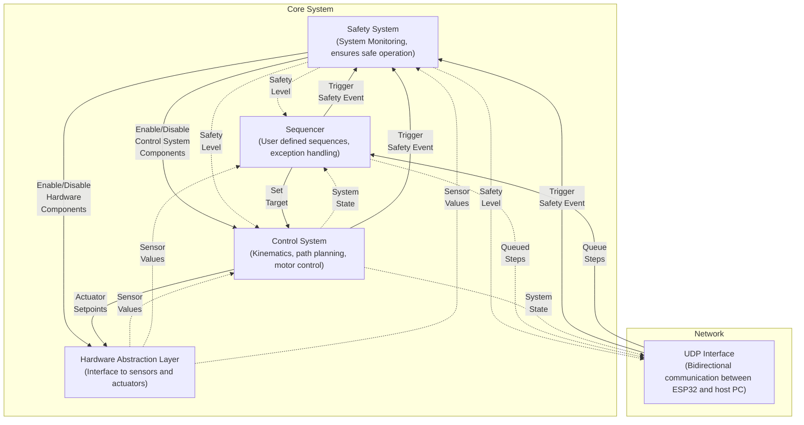
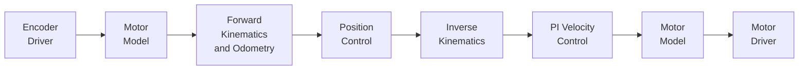

# Mobiler Ausbildungsroboter ESP32

&emsp;

A mobile differential-drive robot educational platform built on the **Waveshare General Driver for Robots (ESP32-WROOM-32UE)** with **ESP-IDF** and **PlatformIO**.

## Architecture Overview

The system is designed in four layers (Safety System, Control System, Sequencer, Hardware Abstraction Layer). Solid lines indicate write operations, while dashed lines stand for read only. Users can only interact with the sequencer, e.g. to queue new goal states for the robot.

| Layer | Target Core | Priority | Status |
|---|---|---|---|
| **Sequencer** | Core 0 | Non RT (~50-100 Hz) | Implemented |
| **Control System** | Core 1 | Hard RT (~500-1000 Hz) | Implemented |
| **Safety System** | Core 1 | Hard RT (500-1000 Hz) | Implemented |
| **HAL** | Core 0 | Direct Register Access | Implemented |
| **UDP Telemetry** | Core 0 | Non RT (50 Hz) | Implemented |

## Current Status

**UDP telemetry infrastructure is implemented.** This provides:

- WiFi STA connection to a router
- UDP socket for bidirectional communication
- Batched telemetry packets (20 samples/batch, ~50 Hz send rate) containing safety + control samples
- Incoming command handling (HELLO registration, GOODBYE unregistration, safety state commands)

**Hardware Abstraction Layer (HAL)** controls the physical hardware:

- **Motor Driver** — TB6612FNG via PWM; per-motor voltage control with direction, INA219 bus voltage monitoring
- **Encoder Driver** — ESP-IDF PCNT quadrature encoding; 2 encoders with configurable transmission ratio

**Safety System** provides a hierarchical state machine with event-driven transitions via FreeRTOS queues, task registration for coordinated shutdown, and automatic motor disable on emergency.

**Control System** provides a main control task that allows to add a custom control logic. For the purpose of testing and demonstration the following control architecture is implemented:

- Encoder Driver: Read encoder values (input shaft angles)
- Motor Model: Calculate joint (wheel) velocities
- Kinematics: Calculate the robot position in global frame (forward kinematics and odometry)
- Cartesian Position Control: Calculate the velocities of the robot in the robot frame so that it moves along a smooth trajectory to a target position in global space.
- Kinematics: Calculate the joint velocities from the robot velocities (inverse kinematics)
- Joint Space Control: Kinematic PI velocity control
- Motor Model: Calculate the motor voltage
- Motor Driver: Set the motor voltages using the motor driver

The **sequencer** is implemented as a doubly linked list that can store a sequence of steps. Currently two step types are implemented:
- MoveToPose: Moves to a specified pose in global space (x, y, phi).
- Wait: Waits for a specified duration in ms.

## Build & Run

### Prerequisites

- [PlatformIO](https://platformio.org/) installed in VS Code (or CLI)
- ESP-IDF components included with PlatformIO

### Commands

Use the PlatformIO's `Build`, `Upload`, `Test` and `Serial Monitor` commands available in the command palette to build and run the application.

## Configuration

Some constants are used from different components of the system. In order to avoid constants from drifting apart, all the configurabel constants are gathered in `include/config.h` and the `main_app()` method in `src\main.c` is responsible to hand them over to the individual components during their initialisation. On the other hand, each component should accept a config struct during initialisation.

Therefore, to change the configuration, edit `include/config.h` accordingly and make sure that the `main_app()` methods correctly uses them to fill the config structs of the individual components.

> **Note:** These values are baked into the binary. Any change requires a full reflash.
